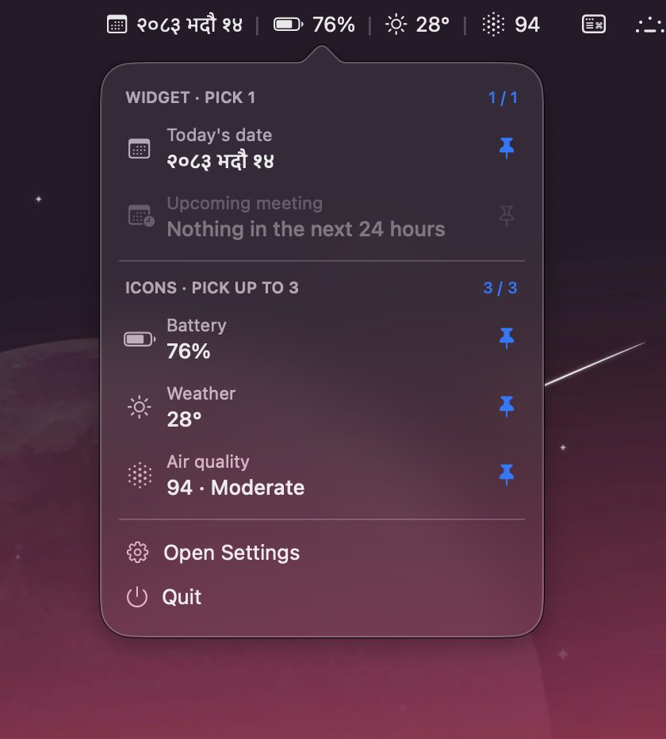

# HeyNav

Menu bar utility for macOS. Bikram Sambat date, battery, weather, air quality and your next
meeting — pin the ones you want.




## Features

- **Bikram Sambat date** in eight formats, Devanagari or Latin
- **Battery** level, with a charging indicator
- **Weather** and **air quality** for any city, no API key needed
- **Next meeting** from Calendar, over a window you choose
- Pin one widget and up to three icons at once
- Launch at login
- No dock icon, no window, no account

## Install

Download the latest release, open the `.dmg`, and drag **HeyNav** to Applications.

### First launch

HeyNav isn't signed with an Apple Developer ID, so macOS blocks it the first time and may
say it is damaged. It isn't — macOS says that about any app it can't trace to a paid
developer account. The source is in this repository if you'd like to check it, or build it
yourself with the steps below.

To open it:

1. Double-click HeyNav and let the warning appear, then dismiss it.
2. Open **System Settings → Privacy & Security**, scroll down, and click **Open Anyway**.

Or, from the terminal:

```sh
xattr -dr com.apple.quarantine /Applications/HeyNav.app
```

You only need to do this once. Updates mean downloading the new version and replacing the
old one — an unsigned app can't update itself.

### Build from source

```sh
git clone https://github.com/HimansuThapa2059/HeyNav.git
cd HeyNav
xcodebuild -project HeyNav.xcodeproj -scheme HeyNav -configuration Release build
```

Copy `HeyNav.app` from the build products directory to `/Applications`. An app you build
yourself is never quarantined, so none of the above applies.

## Usage

Click the menu bar item to open the picker. Pin **one widget** and **up to three icons**.

| Item             | Size   | Requires        |
| ---------------- | ------ | --------------- |
| Today's date     | Widget | —               |
| Upcoming meeting | Widget | Calendar access |
| Battery          | Icon   | —               |
| Weather          | Icon   | A city          |
| Air quality      | Icon   | A city          |

Weather and air quality have no default location. Until you pick a city in **Settings →
Location** they show _(setup needed)_ and cannot be pinned.

Settings has four tabs: General (launch at login, temperature unit), Date (format),
Calendar (how far ahead to look), and Location.

## Requirements

- macOS 26.5 or later
- Xcode 26.6 or later to build

## Privacy

Sandboxed, with two optional permissions:

- **Calendar** — reads your next event's title and start time. EventKit has no read-only
  tier, so macOS asks for full access. Decline it and only the meeting item is affected.
- **Network** — [Open-Meteo](https://open-meteo.com) for weather, air quality and city
  search. No API key, no account.

No analytics, no telemetry, no data leaves your machine otherwise.

## Bikram Sambat conversion

Bikram Sambat month lengths are published by the Nepali calendar authorities rather than
derived by formula, so conversion uses a lookup table.

The bundled table covers **BS 2000–2088** (**AD 1943-04-14 to 2032-04-13**). Dates outside
that range show as `—`. To extend it, add rows to `calendarData` in
[`HeyNav/NepaliDate.swift`](HeyNav/NepaliDate.swift).

## Building

```
HeyNav.xcodeproj/   Xcode project
HeyNav/             app target sources
HeyNavTests/        test target sources
```

Both source folders use Xcode's synchronized groups — adding a `.swift` file to the folder
adds it to the target, with no project file to edit.

Common tasks are in the `Makefile` — run `make` to list them:

```sh
make build     # Debug build
make test      # run the test suite
make run       # build and launch
make release   # Release build, zipped into dist/
make dmg       # drag-to-Applications disk image
```

47 tests cover date conversion and formatting, pin persistence, AQI bands, battery glyph
selection, and API response decoding against recorded responses. UI behaviour is not
covered.

## Known issues

- No signed or notarized release, so macOS blocks the first launch (see above).
- Text fields in Settings do not draw an insertion point until the app is activated, a
  limitation of windows owned by an `LSUIElement` app.

## Contributing

Issues and pull requests welcome. Run the tests before opening a pull request, and keep
each change to a single concern.

## License

[MIT](LICENSE).

Weather and air quality data from [Open-Meteo](https://open-meteo.com), licensed
[CC BY 4.0](https://creativecommons.org/licenses/by/4.0/).
